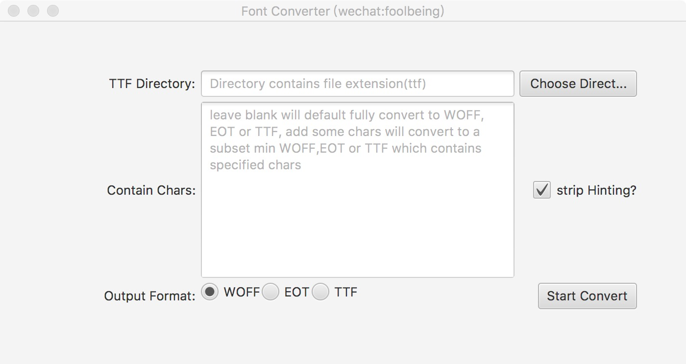

Font Converter
===================

a javafx gui for **[google sfntly](https://github.com/googlei18n/sfntly)** to help subset ttf fonts , convert to ttf/woff/eot.




Requirements
============
* Maven 3.5 (older versions might work too)
* Java Developer Kit 8 with at least Update 40

OS-specific requirements
========================
* (Windows) EXE installers: Inno Setup
* (Windows) MSI installers: WiX (at least version 3.7)
* (Linux) DEB installers: dpkg-deb
* (Linux) RPM installers: rpmbuild
* (Mac) DMG installers: hdiutil
* (Mac) PKG installers: pkgbuild

Build
=====
* build native package

```
 mvn jfx:native 
 ```